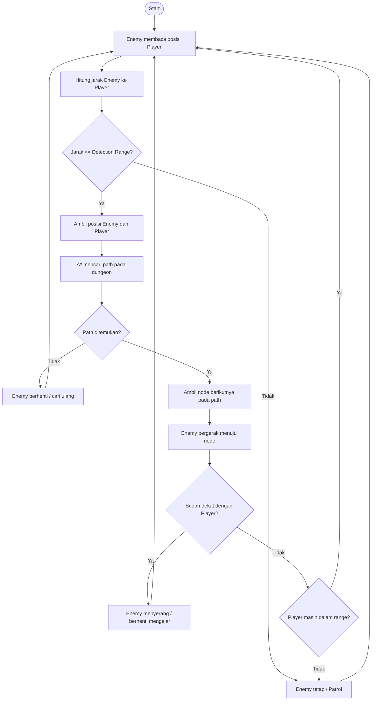

# Enemy AI Dungeon — Deteksi Player, Pathfinding, dan Movement

## 1. Identifikasi Algoritma

Algoritma yang digunakan adalah kombinasi:

1. **Distance/Range Detection**
   - Enemy menghitung jarak antara posisi enemy dan player.
   - Jika jarak <= detection range, player dianggap terdeteksi.

2. **A* (A-Star) Pathfinding**
   - Setelah player terdeteksi dan berada dalam jangkauan, enemy mencari jalur menuju player.
   - A* menggunakan:
     - `g(n)` = biaya dari posisi awal ke node saat ini.
     - `h(n)` = estimasi jarak dari node saat ini ke player.
     - `f(n) = g(n) + h(n)`.

3. **Movement Following Path**
   - Enemy bergerak menuju node-node yang dihasilkan A*.
   - Ketika posisi player berubah, path dapat dihitung ulang agar enemy terus mengejar player.

### Alur singkat

**Deteksi player → cek range → A* mencari jalur → enemy bergerak mengikuti path → ulangi.**

---

## 2. Flowchart



---

## 3. Code Snippet C++

Contoh menggunakan **grid 2D** sebagai dungeon. Nilai `0` adalah jalan dan `1` adalah tembok.

Lihat implementasi lengkap pada [main.cpp](./main.cpp).

### Inti algoritma

```cpp
while (gameRunning) {

    if (isPlayerInRange(enemy, player, detectionRange)) {

        vector<Point> path =
            aStar(dungeon, enemy, player);

        if (!path.empty()) {
            moveEnemyAlongPath(path);
        }
    }
}
```

### Cara kerja

Misalnya posisi:

- Enemy = `(4, 0)`
- Player = `(0, 5)`

Program melakukan:

1. Menghitung jarak enemy ke player.
2. Mengecek apakah player masuk detection range.
3. Menjalankan A* jika player terdeteksi.
4. Menghindari cell yang merupakan tembok.
5. Menghasilkan path dari enemy ke player.
6. Enemy mengikuti node-node pada path tersebut.

## Kesimpulan

Algoritma utama untuk **mencari jalur menuju player** adalah **A***. Sebelum pathfinding dilakukan, enemy menggunakan **range detection** untuk menentukan apakah player berada dalam jangkauan pengejaran. Setelah path ditemukan, enemy bergerak mengikuti jalur tersebut.
