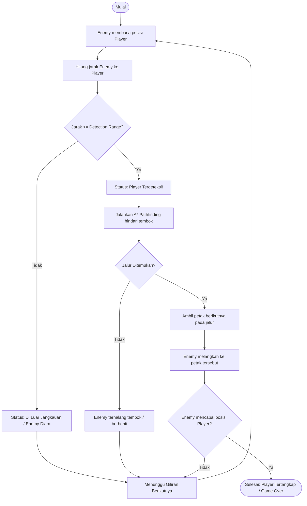

# Jawaban Tugas Pertemuan 1

**Identitas Mahasiswa:**
- **Nama:** Muhammad Geraldi Arisyi
- **Email:** geraldiarisyi27@gmail.com

---

### Soal:
> *"Player bergerak di dalam sebuah dungeon. Enemy harus mendeteksi player, menentukan apakah player berada dalam jangkauan, mencari jalur menuju player, kemudian bergerak menuju player."*

---

## 1. Analisis & Identifikasi Algoritma

Penyelesaian masalah ini menggunakan kombinasi tiga komponen utama:

1. **Range Detection (Deteksi Jarak Jangkauan)**
   - Menghitung jarak posisi Enemy $(x_e, y_e)$ terhadap Player $(x_p, y_p)$.
   - Menggunakan perbandingan jarak Euclidean kuadrat untuk efisiensi komputasi:
     $$\Delta x^2 + \Delta y^2 \le \text{Detection Range}^2$$
   - **Aturan:** Jika jarak $\le$ detection range, Player terdeteksi dan Enemy mulai mengejar. Jika tidak, Enemy berstatus diam/patroli.

2. **A* (A-Star) Pathfinding (Pencarian Jalur Terpendek)**
   - Setelah Player terdeteksi, algoritma A* mencari jalur terpendek dari posisi Enemy ke posisi Player dengan menghindari rintangan/tembok (`1`).
   - Fungsi evaluasi:
     $$f(n) = g(n) + h(n)$$
     - $g(n)$: Biaya langkah nyata dari titik awal Enemy ke petak saat ini.
     - $h(n)$: Estimasi jarak sisa ke Player menggunakan **Manhattan Distance** (karena gerakan orthogonal 4 arah):
       $$h(n) = |x_n - x_{\text{player}}| + |y_n - y_{\text{player}}|$$
     - $f(n)$: Total perkiraan biaya. Petak dengan $f(n)$ terendah diprioritaskan dieksplorasi menggunakan `priority_queue` (min-heap).

3. **Movement Execution (Pergerakan Mengikuti Jalur)**
   - Enemy melangkah ke simpul/petak berikutnya pada rute (`path[1]`).
   - Pada setiap giliran, posisi diperbarui dan jalur dihitung ulang secara dinamis mengikuti pergerakan Player.

---

## 2. Diagram Alir (Flowchart)

---

## 3. Struktur Modul Kode

Program dipecah secara modular (*Separation of Concerns*) agar kode bersih dan mudah dipahami:

| File | Peran & Tanggung Jawab |
| :--- | :--- |
| **[AStar.h](./AStar.h)** | Modul Algoritma: struktur `Point`, `Node`, heuristik Manhattan, deteksi jangkauan, dan fungsi `aStar()`. |
| **[Dungeon.h](./Dungeon.h)** | Modul Game Engine: visualisasi peta dungeon ASCII (`renderDungeon`) dan logika perputaran giliran (`enemyTurn`). |
| **[main.cpp](./main.cpp)** | File Utama: inisialisasi matriks dungeon, pengaturan range deteksi, dan menu mode permainan. |

---

## 4. Kesimpulan

1. **Range Detection** berhasil membatasi area kewaspadaan musuh agar tidak mengejar Player yang berada di luar jangkauan.
2. **Algoritma A*** secara optimal menemukan rute terpendek menuju target di dalam labirin berpenghalang tembok dengan mengevaluasi biaya langkah terkecil $f(n) = g(n) + h(n)$.
3. **Turn-based Movement** memungkinkan simulasi dinamis di mana Enemy mengejar langkah demi langkah hingga Player tertangkap.

